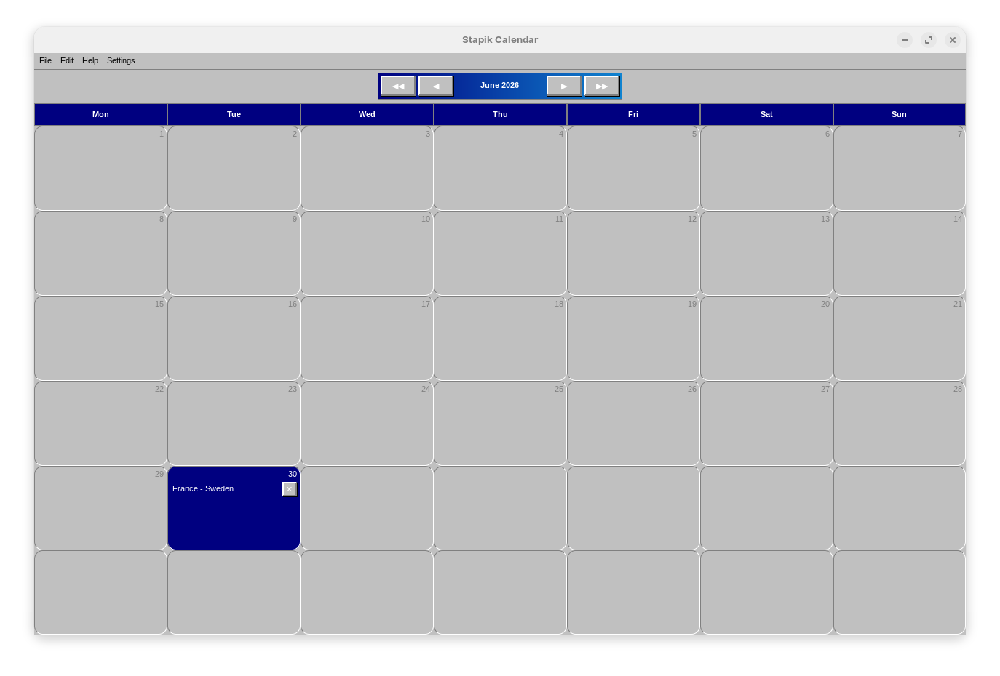

# Stapik Calendar

A desktop calendar application for Linux, written in C++20 using GTK4/gtkmm. Styled after the retro old-school aesthetic.



## Features

- **Monthly view** - calendar grid with month and year navigation
- **Calendar entries** - add, edit and delete entries with a name and optional link
- **Quick add from clipboard** - right-clicking a cell automatically fetches the page title from a URL copied to the clipboard and creates an entry
- **Undo/Redo** - full operation history for adding, editing and deleting entries
- **Cloud sync** - save and load data via an external API (compatible with a self-hosted server)
- **Multilingual UI** - Polish, English and German interface with instant switching
- **Auto-save** - calendar data saved locally after every change
- **Retro aesthetic** — classic look with raised buttons, blue navigation bar and grey cells

## Dependencies

- `gtkmm-4.0`
- `libcurl`
- `nlohmann/json` (fetched automatically via CMake FetchContent)

On Ubuntu/Debian:
```bash
sudo apt install libgtkmm-4.0-dev libcurl4-openssl-dev
```

## Building

```bash
git clone https://github.com/Stapik-Group/stapik-calendar
cd stapikcalendar
cmake -B cmake-build-release -DCMAKE_BUILD_TYPE=Release
cmake --build cmake-build-release
```

## Installation

```bash
chmod +x packaging/install.sh
./packaging/install.sh
```

Per-user installation — no sudo required. The app is installed to `~/.local/share/stapikcalendar/` and appears in the desktop environment's application menu.

## Uninstalling

```bash
rm -rf ~/.local/share/stapikcalendar
rm ~/.local/bin/stapikcalendar
rm ~/.local/share/applications/stapikcalendar.desktop
```

## Cloud Sync

The app supports synchronization via a self-hosted API server. Go to **File → Connect**, enter the server URL and API key. Data is automatically synced after every change.

The API must expose two endpoints:
- `GET /read?filename=calendar.json` — returns `{ "content": "..." }`
- `POST /write` — accepts `{ "filename": "calendar.json", "content": "..." }`

## Data Storage

Calendar data is stored locally at `~/.local/share/stapikcalendar/calendar.json`. Cloud config at `~/.local/share/stapikcalendar/config.json`. Language preference at `~/.local/share/stapikcalendar/locale.txt`.

## TODO

- [x] General refactor
- [ ] System notifications for upcoming entries
- [ ] Week and day view
- [ ] Export to iCal format (.ics)
- [ ] Entry colors — assign a color to each entry
- [ ] Drag and drop entries between cells
- [ ] Entry search
- [ ] Flatpak / .deb package for easier distribution