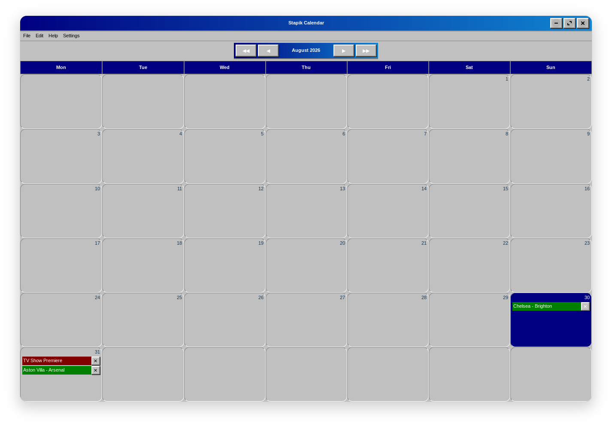
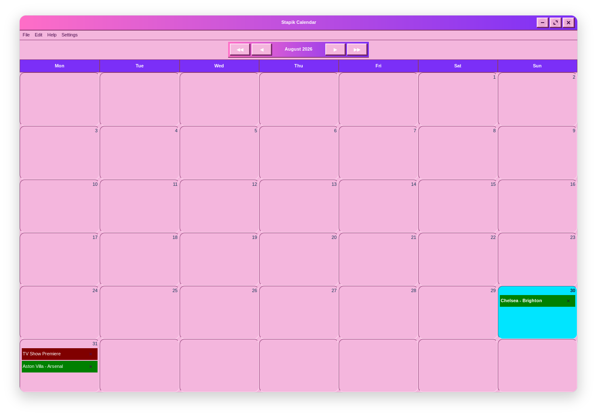
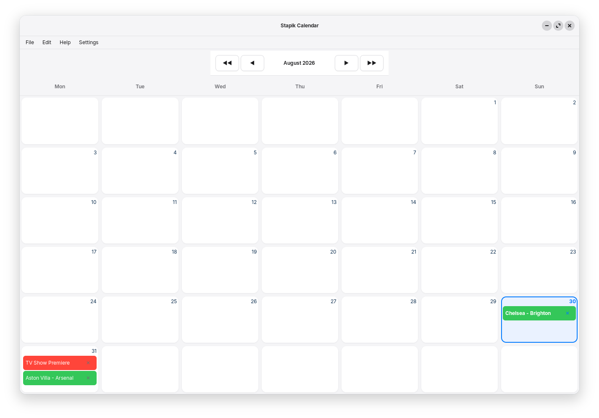

# Stapik Calendar

A desktop calendar application for Linux, written in C++20 using GTK4/gtkmm. Supports multiple visual themes, from a retro look to a modern one.



## Features

- **Monthly view** - calendar grid with month and year navigation
- **Calendar entries** - add, edit and delete entries with a name, optional link and color
- **Entry links** - a single click on an entry that has a link opens it in the default browser (only `http` and `https` links; a link without a scheme is opened as `https://`); a double-click opens the entry for editing
- **Entry colors** - assign one of ten shared category colors to an entry, either from the entry dialog or via a quick right-click popover on an existing entry
- **Drag and drop** - drag an entry to another day to move it; hold **Ctrl** while dragging to copy it instead
- **Quick add from clipboard** - right-clicking an empty cell automatically fetches the page title from a URL copied to the clipboard and creates an entry
- **Undo/Redo** - operation history for adding, editing, deleting, moving and copying entries (up to 100 steps), with the operation named in the menu and `Ctrl+Z` / `Ctrl+Shift+Z` shortcuts
- **Cloud sync** - background synchronization with an external API (compatible with a self-hosted server), automatic retries when offline, conflict resolution based on timestamps and a sync status indicator
- **User guide** - **Help → Guide** (or `F1`) opens a full illustrated guide in your browser, in Polish, English or German
- **Multilingual UI** - Polish, English and German interface with instant switching
- **Themes** - switch between **Classic** (retro Win98), **Neoclassic** (a softer, XP-inspired take on the classic look), **Modern** (light, rounded, macOS-inspired), **Dark** (the modern look on a dark palette) and **Classic Pink** (Win98 layout with a vaporwave pink/purple/cyan palette) from **Settings → Theme**; the choice is remembered between launches
- **Auto-save** - calendar data saved locally after every change, atomically and with rotating backups

## Dependencies

- `gtkmm-4.0` and `sigc++-3.0`
- `libcurl`
- CMake 4.2 or newer
- [`stapik-common`](https://github.com/Stapik-Group/stapik-common) 1.3.2 (fetched automatically via CMake FetchContent) - it provides the application framework: settings, localization, themes, menu, undo stack, document storage and cloud sync
- `nlohmann/json` (fetched automatically via CMake FetchContent, transitively provided by `stapik-common`)

On Ubuntu/Debian:
```bash
sudo apt install libgtkmm-4.0-dev libcurl4-openssl-dev
```

Building a `.deb` package additionally requires `dpkg-dev` (used to auto-detect runtime dependencies):
```bash
sudo apt install dpkg-dev
```

## Building

```bash
git clone https://github.com/Stapik-Group/stapik-calendar
cd stapik-calendar
cmake -B cmake-build-release -DCMAKE_BUILD_TYPE=Release
cmake --build cmake-build-release
```

## Installation

### Option 1 — Download prebuilt `.deb` (recommended)

Download the latest `.deb` package from the [Releases page](https://github.com/Stapik-Group/stapik-calendar/releases), then install it:

```bash
sudo dpkg -i stapikcalendar_*.deb
sudo apt install -f   # resolves any missing runtime dependencies
```

### Option 2 — build `.deb` from source

If you'd rather build the package yourself:

```bash
cd cmake-build-release
cpack -G DEB
sudo dpkg -i stapikcalendar_*.deb
sudo apt install -f
```

Either option installs the app to `/opt/stapikcalendar/` (binary, resources and shared `stapik-common` resources), with a launcher at `/usr/bin/stapikcalendar`, a desktop entry `pl.stapik.calendar.desktop` and an icon, so it appears in the desktop environment's application menu.

### Option 3 — per-user install (no sudo required)

The launcher records the installation prefix at configure time, so set both prefixes when configuring:

```bash
cmake --install cmake-build-release --prefix "$HOME/.local"
```

Installs to `~/.local/lib/stapikcalendar/`, with a launcher at `~/.local/bin/stapikcalendar`. Make sure `~/.local/bin` is in your `PATH`.

## Uninstalling

### If installed via `.deb`

```bash
sudo dpkg -r stapikcalendar
```

### If installed per-user

```bash
rm -rf ~/.local/lib/stapikcalendar
rm ~/.local/bin/stapikcalendar
rm ~/.local/share/applications/stapikcalendar.desktop
rm ~/.local/share/icons/hicolor/256x256/apps/stapikcalendar.png
```

Either way, your calendar data and settings remain in `~/.local/share/stapikcalendar/` and `~/.config/stapikcalendar/` — see [Data Storage](#data-storage) below if you want to remove those too.

## Cloud Sync

The app supports synchronization via a self-hosted [Stapik Cloud](https://github.com/Stapik-Group/stapik-cloud) server (or any other with compatible api [Stapik Cloud API](https://github.com/Stapik-Group/stapik-cloud/blob/master/backend/src/main/resources/openapi/app-api.yaml)). Go to **File → Connect**, enter the server URL and the API key issued for this specific device (generated per-device from the Stapik Cloud admin panel — there is no shared or global key, and each device gets its own, independently revocable).

Once connected, the app compares the local document and the cloud copy using a timestamp and keeps whichever one is newer, overwriting the other **as a whole document**. There is no field-level or entry-level merging — if both copies changed since the last sync, the write that's based on the older cloud state loses.

Unlike the original simple sync protocol, a losing write isn't necessarily gone for good. Each cloud document slot has a conflict-resolution strategy set in the admin panel:
- **Last-write-wins with shadow copy** (the default) — the losing write is kept in the document's version history and can be restored from the admin panel.
- **Last-write-wins** — the losing write is discarded, matching the original behavior.

Data is saved locally after every change. Synchronization runs in the background, so it never blocks the window: a change is pushed to the cloud about 1.5 seconds after the last edit, and pending changes are flushed when you close the window. If the cloud is unreachable, the change stays saved locally and the app retries automatically with an increasing delay (from 2 seconds up to 5 minutes) — no data is lost, but the cloud copy lags behind until a write succeeds. A status indicator at the bottom of the window (shown only when a cloud is configured) tells whether the calendar is up to date, syncing, offline, in conflict or failed. You can also trigger a sync manually from **File → Sync**.

When the server version wins a conflict, it replaces the local document and the undo history is cleared, because earlier operations no longer match the data.

**Upgrading from 1.1.x:** version 1.2.0 changed the document format stored in the cloud (the timestamp is now part of the synchronized document). Upgrade every device before connecting any of them to the same cloud slot — a 1.1.x client cannot read the new format and would treat the cloud document as empty. A cloud document written by 1.1.x is still read by 1.2.0 and is replaced with the new format on the next successful write.

**Caution for multi-device use:** editing the calendar offline on two different machines before either one reconnects can still cause one set of changes to lose the conflict. With shadow-copy resolution (the default), that copy isn't destroyed — it's recoverable from the admin panel's version history — but it won't reappear in the app on its own; recovering it means restoring it from the admin panel and syncing again. If you use the app on more than one device, sync (or at least go online) after each editing session to avoid needing a manual restore.

### API

The app talks to a Stapik Cloud server (or any server implementing the same contract):

- `GET /api/v1/documents/{slotKey}` — returns `{ "slotKey": "...", "content": "...", "contentHash": "...", "updatedAt": "..." }`
- `PUT /api/v1/documents/{slotKey}` — accepts `{ "content": "...", "clientLastKnownUpdate": "..." }`, returns the same shape as `GET`. Status `200` means the write was accepted; `409` means it lost a conflict, and the response body is the current, winning document rather than an echo of what was sent.

Authentication: `x-api-key` header with a per-device key from the admin panel. The old `/read`/`/write` endpoints and the single shared API key are no longer supported — existing installations need to be reconnected in **File → Connect** with a newly issued key.

## Data Storage

Calendar data is stored locally at `~/.local/share/stapikcalendar/calendar.json` as a versioned document:

```json
{
  "schemaVersion": 1,
  "document": {
    "lastUpdate": "2026-10-04T12:00:00Z",
    "entries": [ { "date": "2026-10-04", "name": "...", "link": "...", "color": "teal" } ]
  }
}
```

Each entry stores a name, an optional link and a color id (`default`, `red`, `orange`, `yellow`, `green`, `teal`, `blue`, `purple`, `pink`, `brown` or `gray`). Files written by older versions (a bare entries array, or the `lastUpdate` / `payload` envelope) are migrated automatically on the first start; the pre-migration file is kept as `calendar.json.bak`.

Next to it:

- `calendar.json.bak`, `calendar.json.bak.2`, `calendar.json.bak.3` - the three previous versions, rotated on every save
- `calendar.json.corrupt-<timestamp>` - a file that could not be parsed, moved aside so it is never overwritten
- `calendar.json.unreadable-<timestamp>` - a copy of a file written by a newer version of the app (or one that failed to migrate); the app starts with an empty calendar instead of touching the original
- `cloud-baseline.json` - the cloud timestamp this device last synchronized with (local sync state, never uploaded)
- `config.json` - cloud configuration (server URL and API key)

Language and theme preferences are stored in `~/.config/stapikcalendar/settings.json`; the `locale.txt` and `theme.txt` files of earlier versions are imported on the first start.

## Architecture

```
src/
  application/   CalendarController - owns the document, undo history, local storage and the cloud session (no widgets)
  core/          model (CalendarDocument, CalendarEntry), commands (ICommand) and utilities
  infrastructure/storage/   CalendarDocumentStore - versioned, atomic persistence with backups and migration
  ui/            window, views, dialogs and widgets; views only read from the controller and report user intents
```

Shared building blocks (settings, localization, themes, menu, dialogs, undo stack, document file, cloud session) come from [`stapik-common`](https://github.com/Stapik-Group/stapik-common).

## Continuous integration

GitHub Actions (`.github/workflows/ci.yml`) builds every pull request into `master` and every branch except `develop`. Pushing a tag `vX.Y.Z` on `master` (the tag must match the version in `CMakeLists.txt`) builds the `.deb` package and publishes it, with a SHA-256 checksum, as a GitHub release.

## Themes




## TODO

- [x] General refactor
- [x] Cloud sync with conflict resolution
- [x] `.deb` package for easier distribution
- [x] Entry colors — assign a color to each entry
- [x] Drag and drop entries between cells (with copy via Ctrl)
- [x] Theme switcher — Classic / Neoclassic / Modern / Dark / Classic Pink
- [x] Migration to stapik-common 1.2.0 — background sync, versioned storage, shared colors and menu
- [ ] Export to iCal format (.ics)
- [ ] Entry search
- [ ] Flatpak package